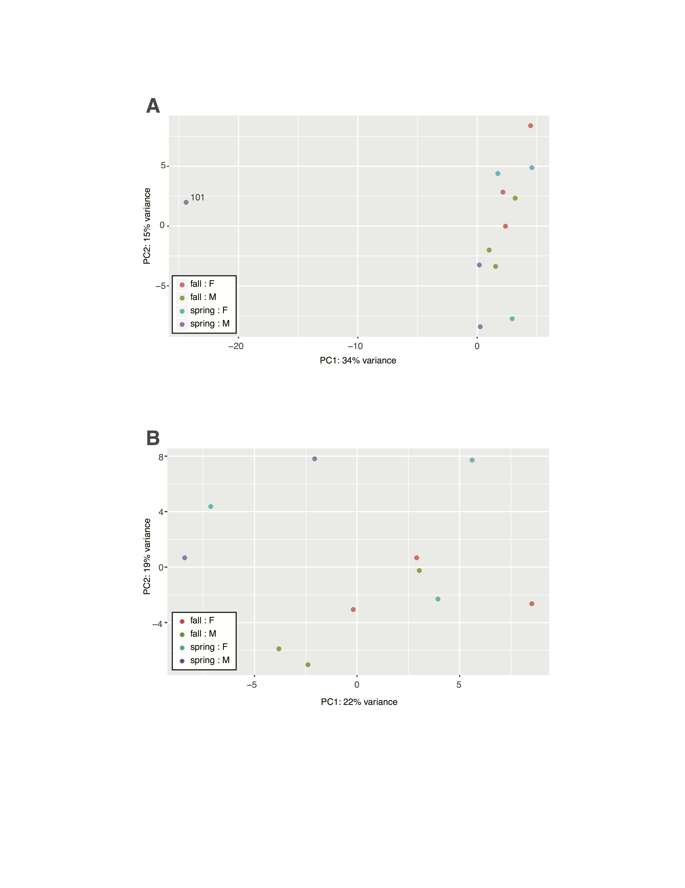

This is a template to be shared with Ron as a demo for creating GitHub derived http pages. Great resource starting from zero by Jenny Bryan: http://happygitwithr.com

# Header 1
## Header 2
### Header 3
#### Header 4

## Adding figure
```{r Supp figure 1, echo=FALSE, fig.align="center"}
# http output does not like pdf images, so convert to png to conserve space

```
Figure S1 caption and legends

#Downlod original files and figures:
[Click here](Bear_data/Supplemental_Figure_S1.pdf)
