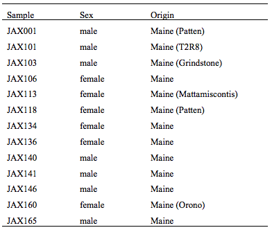
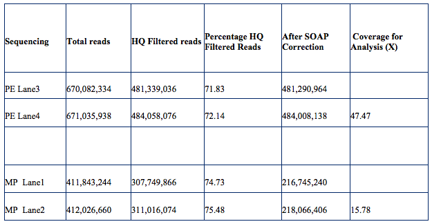
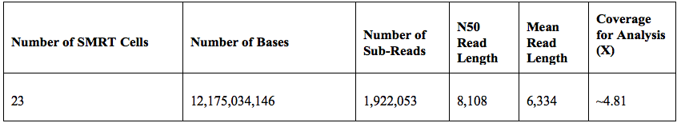
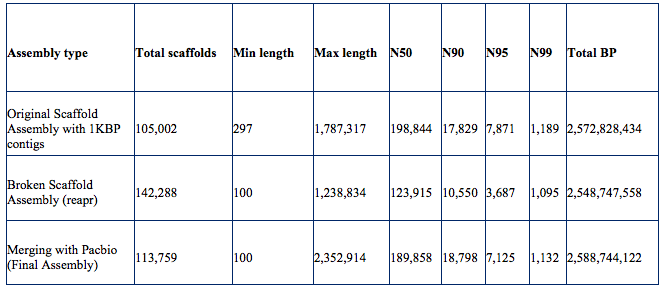
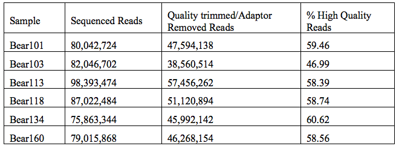
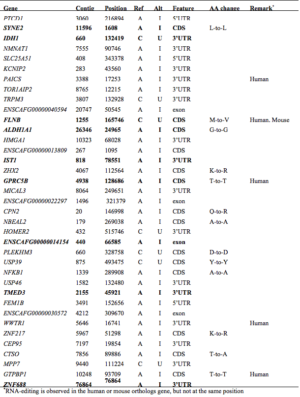

<br>

#### Supplemental Table 1 | Sample information
Samples from 13 black bears were used in this study. A sample from a single male bear (JAX001) was used to sequence and assemble the initial draft genome.
```{r Supp table 1, echo=FALSE, fig.align="center"}
# http output does not like pdf images, so convert to png to conserve space

```
<br>
<br>

#### Supplemental Table 2 | Raw read filtering statistics Illumina for JAX001
```{r Supp table 2, echo=FALSE, fig.align="center"}

```
<br>
<br>

#### Supplemental Table 3 | Raw read filtering statistics PacBio for JAX001
```{r Supp table 3, echo=FALSE, fig.align="center"}

```
<br>
<br>

#### Supplemental Table 4 | Details of the assembled sequence length for JAX001
```{r Supp table 4, echo=FALSE, fig.align="center"}

```
<br>
<br>

#### Supplemental Table 5 | Summary of RNA-Seq Sequencing and quality control
```{r Supp table 5, echo=FALSE, fig.align="center"}

```
<br>
<br>

#### Supplemental Table 6 | Summary of differentially expressed genes
[Click here](https://github.com/TheJacksonLaboratory/KorstanjeLab_Publications/blob/master/Bear_data/Supplemental table T6.xlsx)
<br>
<br>

#### Supplemental Table 7 | Summary of genome sequencing and quality control
```{r Supp table 7, echo=FALSE, fig.align="center"}

```
<br>
<br>

#### Supplemental Table 8 | Summary of coding transcripts with RNA-editing. 
Editing was observed in all 12 samples except for ZNF688 in which we only observed editing in the spring samples. Sites indicated in bold were confirmed with Sanger sequencing of the RNA transcript.
```{r Supp table 8, echo=FALSE, fig.align="center"}

```
<br>
<br>

#### Supplemental figure 1 | Principal component analysis of RNA-Seq data
We determined that sample 101 (from a male in the spring) was an outlier (A). After removing this sample and repeating the analysis (B) we compared the spring samples to the fall samples.
```{r Supp figure 1, echo=FALSE, fig.align="center"}
knitr::include_graphics("../Bear_data/Site_version/Supplemental figure S1.png")
```
<br>
<br>

#### Supplemental figure 2 | Heatmap of all 169 significantly differentially expressed genes
```{r Supp figure 2, echo=FALSE, fig.align="center"}
knitr::include_graphics("../Bear_data/Site_version/Supplemental figure S2.png")
```
